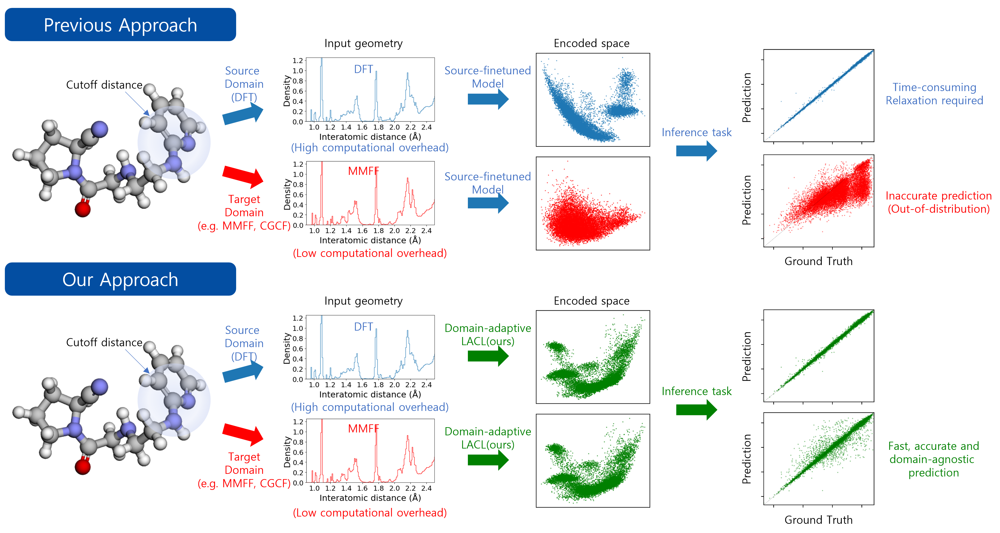

# LACL

Original codebase for [Deep Contrastive Learning of Molecular Conformation for Efficient Property Prediction]()

Yang Jeong Park, HyunGi Kim, Jeonghee Jo and Sungroh Yoon   
Massachusetts Institute of Technology   
Seoul National University



## Abstract
>Data-driven deep learning algorithms provide accurate prediction of high-level quantum-chemical molecular properties. However, their inputs must be constrained to the same quantum-chemical level of geometric relaxation as same with the training dataset, limiting their flexibility. Adopting alternative cost-effective conformation generative methods introduces domain shift problems, deteriorating prediction accuracy. Here we propose a novel deep contrastive learning-based domain adaptation method called Local Atomic environment Contrastive Learning (LACL). LACL learns to alleviate the disparities in distribution between the two geometric conformations by comparing different conformation generation methods. We found that LACL forms a domain-agnostic latent space that encapsulates the semantics of an atom's local atomic environment. LACL achieves quantum chemical accuracy while circumventing the geometric relaxation bottleneck and could enable future application scenarios like inverse molecular engineering and large-scale screening. Our approach is also generalizable from small organic molecules to long chains of biological and pharmacological molecules.   

# Installation
```
conda env create -f lacl.yaml
conda activate lacl
```
# Dataset
You can download datasets used in the paper [here](https://doi.org/10.6084/m9.figshare.24445129) and extract the zip file under `./data` folder. Both QM9 and QMugs should be saved in the folder under their name. Conformations of all the data is pickled after preprocessing. 
## [QM9](https://figshare.com/collections/Quantum_chemistry_structures_and_properties_of_134_kilo_molecules/978904)
`qm9_all.pickle`   
List of dictionaries with properties. One dictionary corresponds to one molecule. It also contains cartesian coordinates of MMFF conformations and MMFF potential.   
`qm9_all_cgcf.pkl`   
List of rdkit molecules with cartesian coordinates of CGCF-ConfGen conformations. They were calculated by the official implement of [CGCF-ConfGen](https://github.com/MinkaiXu/CGCF-ConfGen).

## [QMugs](https://www.research-collection.ethz.ch/handle/20.500.11850/482129)
`QMugs_20_energy.pkl`    
List of dataframes containing identifiers, properties, SMILES, and rdkit mols with less than or equal to 20 number of heavy atoms.   
`QMugs_20_energy_mmff.pkl`   
List of rdkit molecules with cartesian coordinates of MMFF conformations. They were calculated by rdkit MMFF optimization.   
`QMugs_20_energy_cgcf.pkl`    
List of rdkit molecules with cartesian coordinates of CGCF-ConfGen conformations. They were calculated by the official implement of [CGCF-ConfGen](https://github.com/MinkaiXu/CGCF-ConfGen).   
     
`QMugs_{num}_energy_test.pkl`   
List of dataframes containing identifiers, properties, SMILES, and rdkit mols with `num` number of heavy atoms. `ex` means mols with more than 40 heavy atoms   
`QMugs_{num}_energy_mmff.pkl`   
List of rdkit molecules including `num` number of heavy atoms with cartesian coordinates of MMFF conformations.   


# Training
To train LACL, please input following in terminal.
```
python main.py
```
## Arguments explanations    
Please refer `main.py` for details of remaining arguments. Here we show some important arguments briefly.   
`--lacl`    
True for training LACL, False for training modified-ALIGNN    
`--loss`    
contrastive+prediction loss is default   
`--set`    
'src' for source domain and 'tgt' for target domain. LACL doesn't affect this. It's for modified-ALIGNN training.  
`--target`    
QM9: **mu**, alpha, **homo**, **lumo**, **gap**, r2, zpve, **U0**, U, **G**, H, and Cv.   
QMugs: **GFN2:DIPOLE**, **GFN2:HOMO_LUMO_GAP**, **GFN2:TOTAL_FREE_ENERGY**, [Target labels](data/data.py)   
`--geometry`   
Select target domain   
   
For example, to train LACL on QM9 dipole moment for adapting MMFF geometric domain,   
```
python main.py --lacl True --dataset QM9 --target mu --geometry MMFF
```


# Acknowledgement
- Pytorch implementation of ALIGNN: https://github.com/usnistgov/alignn
- Self-supervised learning strategies for GNN: https://github.com/nerdslab/bgrl
- Data generation using CGCF-ConfGen: https://github.com/MinkaiXu/CGCF-ConfGen
